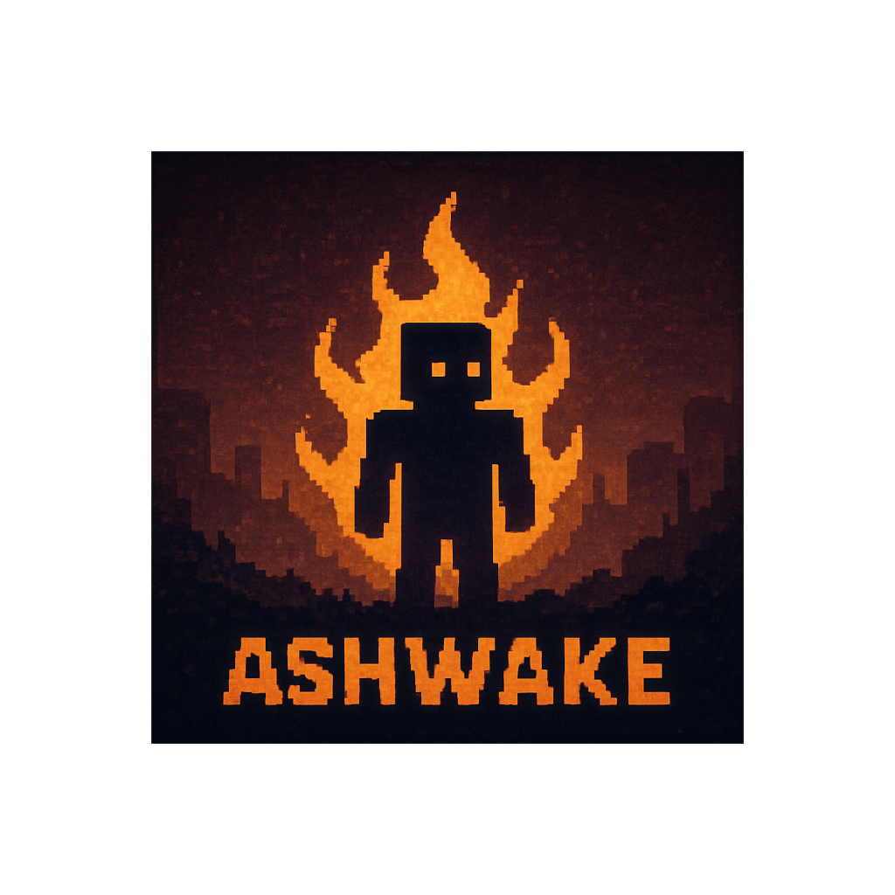

## A Desolate Survival RPG

Ashwake is a sandbox survival RPG set in the desolate aftermath of a forgotten age. In a world where Velrot, an unknown and insidious corruption, has twisted the land and life itself, you awaken alone—an Amnesis Unit, a biomechanical vessel with no memory and no past.

With no guidance, no cities, and no other sentient beings to speak to, your path is your own. Explore, survive, and uncover the truth buried under ruins and time.

Light is your only ally. Night brings out the worst of this broken world: creatures born of elemental distortion, called forth by the lingering Velrot. By day, you gather, adapt, and reconstruct. By night, you endure.

This is not a quest. There are no scripted destinies. Only echoes.

  

## World & Lore

Centuries ago, the once-glorious civilization of Thalos faced extinction. An incorporeal disease—Velrot—not only infected matter but distorted consciousness, perception, and perhaps reality itself. Desperate to preserve their minds, Thalosian scientists and seers created the Amnesis Units: biomechanical bodies meant to store human memories and survive the end. The process was never completed.

Now, in the silence after collapse, a lone Unit awakens. You.

You know nothing of the world. Not your purpose. Not even your name.

## Core Gameplay Concepts

- **Exploration-Driven Survival**: The world is vast, open, and wild. Survival depends on light, clean water, shelter, and food to keep your body functioning. You must scavenge, craft, and endure.

- **No NPCs, No Towns, No Quests**: You are the only conscious mind. The land is dotted with ruins, relics, and strange mechanisms from a lost era. There are no scripted missions—only what you discover, interpret, or build.

- **Alchemical Progression**: An intricate system of refinement and combination allows transformation of materials into components, fuels, enhancers, or repairs for ancient tech.

- **Elemental Mobs**: Aspects of Velrot have coalesced into nocturnal elemental entities, corrupted echoes of once-living things. Each behaves according to its element and resists typical tools.

- **Artefact Recovery & Reconstruction**: Among ruins, you'll find pieces of old Thalosian machinery. With time, knowledge, and experimentation, you can reactivate or repurpose them, unlocking abilities or altering the landscape.

- **Dimension Travel**: Ancient writings mention Velmire, a place where Velrot originated or took form. It's said the barrier between worlds is thin. Getting there, however, may cost everything.

## Installation

- Unzip the archive, rename the folder to `ashwake` and place it in `.../minetest/games/`
- For GNU/Linux systems with a system-wide installation, place it in `~/.minetest/games/`

## License

See `LICENSE.txt`

*Built upon Minetest Game base*
